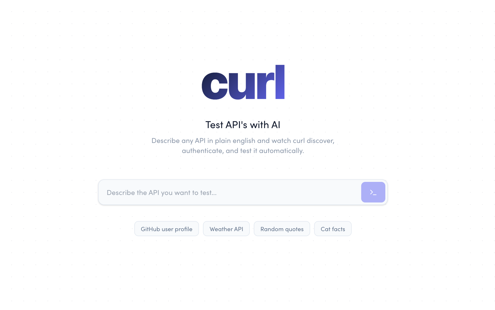

# Curl - AI-Powered API Testing Tool

<div align="center">



**Test any API with AI. Describe APIs in plain English and watch curl discover, authenticate, and test them automatically.**

[](https://nextjs.org/)
[](https://reactjs.org/)
[](https://www.typescriptlang.org/)
[](https://tailwindcss.com/)
[](https://www.anthropic.com/)

[Live Demo](https://trycurl.com) • [Report Bug](https://github.com/kdotin/curl/issues) • [Request Feature](https://github.com/yourusername/curl/issues)

</div>

---

## ✨ Features

🤖 **AI-Powered Discovery** - Describe any API in natural language  
🔐 **Smart Authentication** - Automatic handling of Bearer tokens, API keys, and Basic auth  
💬 **Conversational Interface** - Chat-based API testing experience  
📊 **Intelligent Summaries** - AI-generated response explanations  
🎨 **Beautiful UI** - Modern design with light/dark theme support  
⚡ **Real-time Testing** - Instant API responses with detailed debugging info  
📋 **Copy-Friendly** - One-click copying of curl commands, responses, and headers  
🔄 **Smart URL Parsing** - Automatic extraction of IDs from Airtable, Notion, Shopify URLs  

## 🚀 Quick Start

### Prerequisites

- Node.js 18+ 
- npm/yarn/pnpm
- Anthropic Claude API key

### Installation

1. **Clone the repository**
   ```bash
   git clone https://github.com/kdotin/curl.git
   cd curl
   ```

2. **Install dependencies**
   ```bash
   npm install
   # or
   yarn install
   # or
   pnpm install
   ```

3. **Set up environment variables**
   ```bash
   cp .env.example .env.local
   ```
   
   Add your API keys to `.env.local`:
   ```env
   CLAUDE_API_KEY=your_anthropic_api_key_here
   NEXT_PUBLIC_BASE_URL=http://localhost:3000
   ```

4. **Run the development server**
   ```bash
   npm run dev
   ```

5. **Open your browser**
   Navigate to [http://localhost:3000](http://localhost:3000)

## 💡 Usage Examples

### Basic API Testing
```
"Get the current Bitcoin price"
→ Discovers CoinGecko API
→ Executes: GET https://api.coingecko.com/api/v3/simple/price?ids=bitcoin&vs_currencies=usd
```

### Authenticated APIs
```
"Get my GitHub repositories"
→ Discovers GitHub API
→ Requests Personal Access Token
→ Executes with Bearer authentication
```

### Complex APIs
```
"Get records from my Airtable base"
→ Asks for Airtable Base URL
→ Parses Base ID and Table ID automatically
→ Handles API key authentication
```

## 🏗️ Architecture

### Tech Stack
- **Frontend**: Next.js 15 (App Router) + React 19
- **Styling**: Tailwind CSS 4 with custom theme system  
- **AI**: Anthropic Claude Sonnet 4
- **Language**: TypeScript with full type safety
- **Analytics**: Vercel Analytics

### Project Structure
```
curl/
├── app/
│   ├── api/              # API routes
│   │   ├── curl/         # HTTP request execution
│   │   ├── discover/     # AI-powered API discovery
│   │   └── summarize/    # AI response summaries
│   ├── components/       # React components
│   │   ├── ChatInput.tsx
│   │   ├── ChatMessage.tsx
│   │   ├── ResponseDisplay.tsx
│   │   ├── ThemeProvider.tsx
│   │   └── ThemeToggle.tsx
│   ├── globals.css       # Global styles
│   ├── layout.tsx        # Root layout with metadata
│   └── page.tsx          # Main application page
├── public/               # Static assets
└── package.json
```

### Key Components

**API Discovery Flow:**
1. User describes API in natural language
2. Claude AI analyzes and determines if it's conversational or API-related
3. For APIs: discovers endpoint, method, auth requirements
4. Handles authentication with step-by-step instructions
5. Executes request and generates AI summary

**Authentication Support:**
- Bearer tokens (Personal Access Tokens)
- API keys (with custom header names)  
- Basic authentication
- Smart credential instructions with direct links

## 🛠️ Development

### Available Scripts

```bash
npm run dev        # Start development server with Turbopack
npm run build      # Build for production
npm run start      # Start production server
npm run lint       # Run ESLint
```

### Environment Variables

| Variable | Description | Required |
|----------|-------------|----------|
| `CLAUDE_API_KEY` | Anthropic Claude API key | ✅ |
| `NEXT_PUBLIC_BASE_URL` | Base URL for the application | ✅ |

### Adding New API Integrations

The AI automatically handles most APIs, but you can enhance specific integrations by:

1. **URL Parsing**: Add smart URL parsing in `app/page.tsx` for extracting IDs from service URLs
2. **Auth Instructions**: Enhance authentication instructions in `app/api/discover/route.ts`
3. **Response Formatting**: Customize response display in `components/ResponseDisplay.tsx`

## 🚀 Deployment

### Vercel (Recommended)

1. Push your code to GitHub
2. Connect your repository to [Vercel](https://vercel.com)
3. Add environment variables in Vercel dashboard
4. Deploy automatically on push

### Other Platforms

This is a standard Next.js application and can be deployed on:
- Netlify
- Railway
- AWS Amplify  
- Google Cloud Run
- Docker

## 🤝 Contributing

We welcome contributions! Here's how to get started:

1. **Fork the repository**
2. **Create a feature branch**
   ```bash
   git checkout -b feature/amazing-feature
   ```
3. **Make your changes**
4. **Add tests if applicable**
5. **Commit your changes**
   ```bash
   git commit -m 'Add amazing feature'
   ```
6. **Push to your branch**
   ```bash
   git push origin feature/amazing-feature
   ```
7. **Open a Pull Request**

### Development Guidelines

- Follow TypeScript best practices
- Use the existing component patterns
- Maintain theme compatibility (light/dark)
- Add proper error handling
- Update documentation for new features

## 📝 License

This project is licensed under the MIT License - see the [LICENSE](LICENSE) file for details.

## 🙏 Acknowledgments

- [Anthropic](https://www.anthropic.com/) for Claude AI
- [Vercel](https://vercel.com/) for hosting and Next.js
- [Tailwind CSS](https://tailwindcss.com/) for styling
- [Remix Icons](https://remixicon.com/) for icons

## 📧 Contact

Created by [Krishna Moorthy](https://x.com/kdotinx)

- Twitter: [@kdotinx](https://x.com/kdotinx)
- Website: [trycurl.com](https://trycurl.com)

---

<div align="center">

**If you found this project helpful, please consider giving it a ⭐!**

</div>
